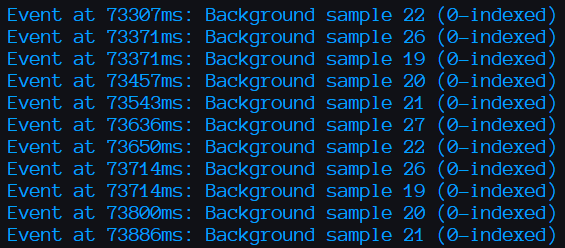
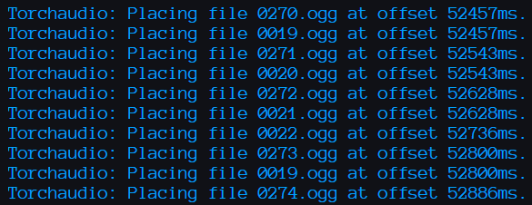
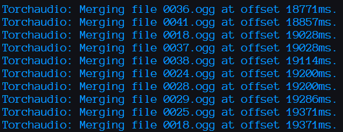
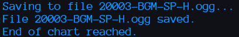

# Elpis

**FOR EDUCATIONAL PURPOSES ONLY.**

## What does this do?

This is a library that can take `.1` level files and `.2dx` or `.s3p` audio container files from the rhythm game "beatmania IIDX" and converts them into the open `.bmson` and `.ogg` level and audio formats, respectively.

## That's a strange name, why is it called that?

The name comes from the first song I tested this with, [ΕΛΠΙΣ (pronounced "elpis") by dj TAKA](https://www.youtube.com/watch?v=DItVx94YIG0). Also, both the name and song itself sound cool, so that's a plus.

## How does it work?
We can break down the process of conversion into several phases, as follows:

### 1. Asset Retrieval (in this case from the test directory)

### 2. Extracting audio files from containers (serialized, not archived)

⋮

### 3. Converting extracted files to .ogg to save space while preserving audio quality
Already-extracted files are automatically skipped to save time.

⋮

### 4. Background audio parsing

Here's where things get interesting. In the original games, unused audio samples are played in the background when they are supposed to on their own dedicated audio channels. However, as I discovered the hard way, the BMSON format only allows for one background audio track at a time. So we need to merge *all* of the background audio together to make it BMSON-compliant, using Torchaudio as my tool of choice. It helps that we don't need to mess with the timing here because both the original games and Torchaudio work in metric (seconds).

To start off, we make a record of which background audio samples happen at what time(s).

Torchaudio works here in two separate passes, the first one to place the audio samples on a virtual audio track, using the above data,

and the second to merge them into the final audio file.

With all of that out of the way, we're finally ready to...

### 5. Parse the chart (level) itself
Unlike before, we need to do some math with the timing here. Unlike the original games, BMSON handles events not in terms of milliseconds from the start, but rather in terms of "pulses" defined by
1. the current tempo (in beats per minute, or BPM) at any given moment, and
2. the number of pulses per quarter note at the given BPM, in our case using the default 240.

So as you can imagine, it took a fair bit of work to properly handle songs with many BPM changes (looking at you, [Waltz of the Big Dog](https://www.youtube.com/watch?v=nPTswi8epEw&t=8s) and [Icarus](https://www.youtube.com/watch?v=s6RNh94JrFw&t=8s)).

⋮

Ta-da!

### Before

### After

#### Inside the "20003" folder:

⋮

## How do I run this?

Since this is a library this is not meant to be "run". Due to the necessary use of closed-source files, this project is purely for educational purposes only.

## Credit where it's due:
- Original inspiration: GitHub user SaxxonPike's [scharfricter](https://github.com/SaxxonPike/scharfrichter)
- Chart file information: [this page](https://github.com/SaxxonPike/rhythm-game-formats/blob/master/iidx/1.md) in the above repo, my edited version of which you can find in the `docs` folder.
- Audio container information: GitHub user hannahherbig's [2dxrender](https://github.com/hannahherbig/2dxrender)
    - Handling of audio containers is optimized from separate C# implementations in the above repo.
### Ultra-special thanks to:
- An unnamed Discord user who wishes to remain anonymous, who provided invaluable test files without which this project would not be feasible.
